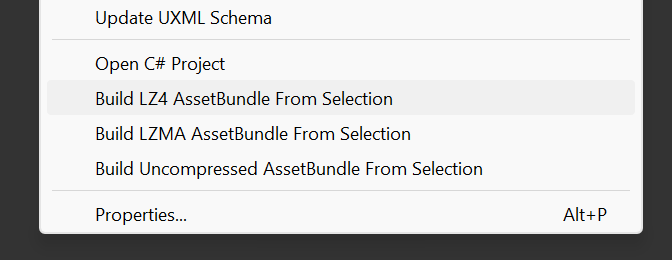
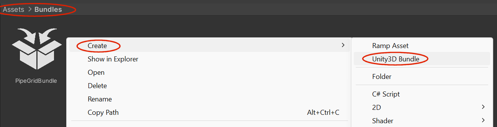
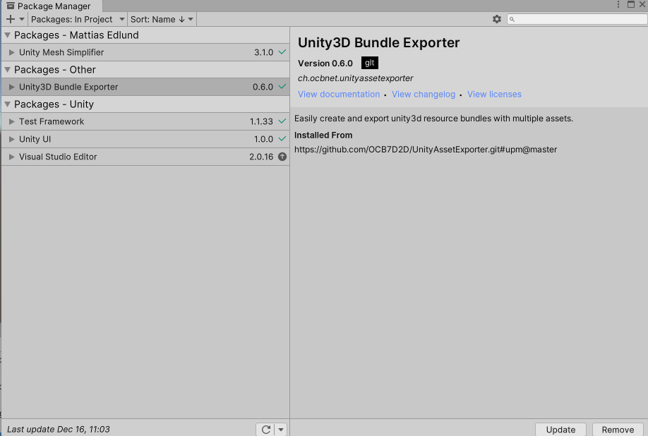
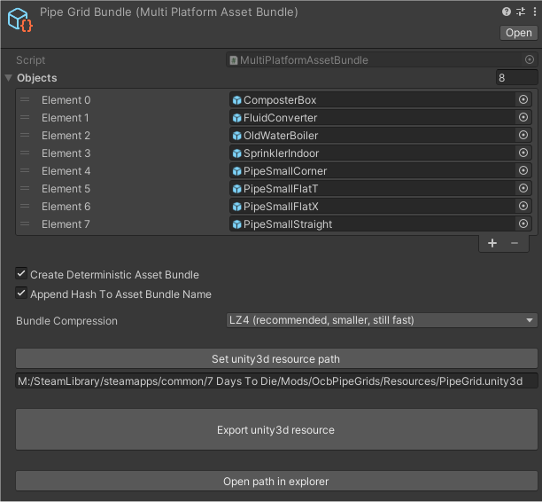
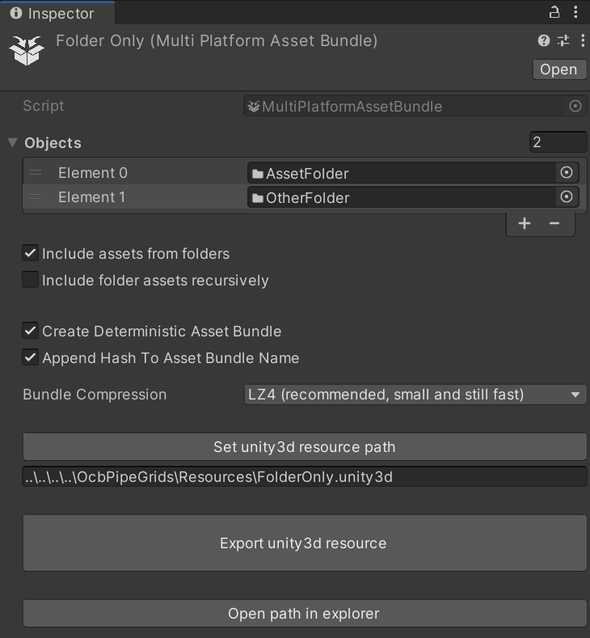
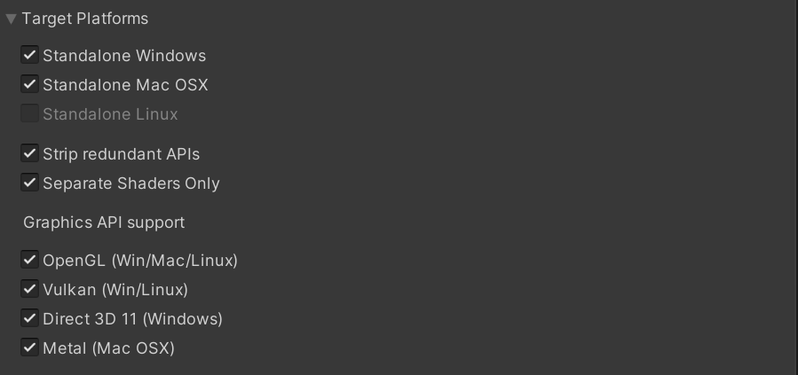

# Unity3D Resource Bundle Multi-Asset Exporter

This package adds two different way to create `unity3d` resource
bundles. It contains the well known asset exporter script known
by the 7 Days to Die modding scene, with different options to
make use of the much faster LZ4 compression more easily.



And an additional more advanced way to handle `unity3d` resource
bundles, by defining all assets that go into the resource bundle
once. You can there also configure various options, e.g. to use
either LZ4 or LZMA compression, and you only define the save
location once. Then you just update the export `unity3d`
bund file on demand by clicking a single button.



## Use in Unity

Use the following url to add it to unity via package manager:

https://github.com/OCB7D2D/UnityAssetExporter.git#upm@master



### Use specific version

You may also use a specific version by specifying a release:

https://github.com/OCB7D2D/UnityAssetExporter.git#upm@0.7.0

See https://github.com/OCB7D2D/UnityAssetExporter/branches

### Add as dependency to your unity project

If you want to add this exporter as a dependency to your project,
you can either do that by using the package manager, or you could
also just edit/create `Packages/manifest.json` with the following:

```json
{
  "dependencies": {
    "ch.ocbnet.unityassetexporter": "https://github.com/OCB7D2D/UnityAssetExporter.git#upm@master",
  }
}
```

## Unity3D Asset Bundle Exporter

Once you have created the asset in any folder, you can start to
configure it. You mainly need to select or drag&drop all assets
you want to export into the `Objects` list.

Then "Set unity3d resource path" to where the final bundle should
be stored. Latest version will make this path relative to make it
easier to copy your unity project around (at least for me).



Alternatively you can enable the incubating feature to just include
everything under certain folders. For that you need to enable the
checkmark "Include assets from folders". Now you can also add
folders directly to the "Objects" list and everything in it will
be included in the export (fine-tune by toggling recursiveness).



### Platform Specific Exporting

Unfortunately unity can't build one unity3d bundle for all platforms,
although most stuff will just work by using the windows specific bundles.
This is due to windows having three graphics APIs: OpenGL, Vulkan and D3D11.
These cover all of Linux APIs (OpenGL and Vulkan), but only partially Mac OSX,
where we have OpenGL and Metal, which is the one API windows doesn't support.

Note that this is only relevant in regard to shaders. Unfortunately most assets
bundles will probably have "custom" shaders, e.g. even by adding some Material
using the built-in shaders. Unity will still compile variants for them and try
to pack them into the asset bundle too. Meaning that metal support is absent.



Only solution is to have a separate asset bundles for Mac OSX metal support.
Building those is easy with the new exporter. Problems arise when trying
to distribute the different version and I have no easy fix for that.

#### Strip redundant API variants option

When this option is enabled, we will not include redundant APIs in the
platform specific bundles. Windows bundle will include the three APIs
it supports (OpenGL, Vulkan, D3D11) and Mac OSX bundle will only contain
the assets for Metal Graphics API. The resulting asset bundle will be
suffices with ".metal" instead of ".mac" if only Metal API is included
in the Mac OSX platform build.

Currently the consensus is that this approach should be safe and only
Mac Users wanting to use the Metal API need the custom asset bundle.
Those using OpenGL should be able to use the regular windows bundle.

#### Separate shaders only option

Enabling this option will only include the shaders in the platform
specific bundle. This is only useful if you load and assign the
shaders programmatically.

## Changelog

### Version 0.7.2

- Improve shader compile logging

### Version 0.7.1

- Add explicit shader stripping options  
  Can ensure fog variants to be present

### Version 0.7.0

- Add platform specific bundle options  
  To address MacOSX issues (e.g. shaders)
- Implement proper undo for unity editor
- Force shaders to build all graphics api
- Use our custom UPM packaging action

### Version 0.6.5

- Fix deployment issue and version
- Fix default filename for old script exporter

### Version 0.6.4

- Fix folder includes to not start from parent folder

### Version 0.6.3

- Fix issue when changing options without game loaded

### Version 0.6.2

- Add old exporter script with different compression options

### Version 0.6.0

- Initial version